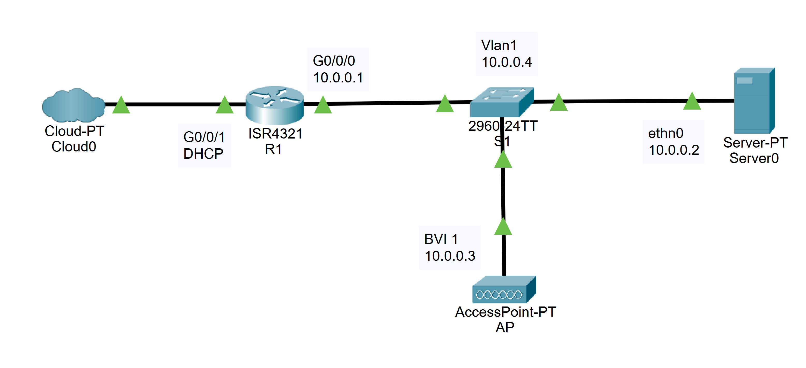

# Standalone Access Point Configuration

This repository contains the configurations for a small office network with a standalone access point that broadcasts multiple SSIDs. Read below for more details.

## IPv4 Topology

This Topology is for IPv4. All 10.0.xx.xx addresses are within the network.

## Purpose

The purpose of this lab is to setup a standalone access point (AP) that broadcasts a 2.4GHz network using a pre-shared key to authenticate users; a 5GHz network also using a pre-shared key to authenticate users; and a 5GHz network with enterprise authentication using RADIUS. All these Wi-Fi networks will be secured using WPA2. Additionally, the other devices are configured to provide internet connectivity for any devices that connect to the AP by using various protocols.

## Summary

- 3 wireless networks
  - One 2.4GHz with WPA2 pre-shared key (WPA2 PSK)
  - One 5 GHz with WPA2 PSK
  - One 5 GHz with WPA2 Enterprise, using RADIUS
- Router: R1
  - Acts as a defaut gateway to the internet
  - Configured with NAT
  - Has DHCP configured for hosts that request an address
- Switch: S1
  - Only trusted ports are trunked
  - Multiple VLAN interfaces for testing and debugging

Wordy Description:\
A standalone access point was configured with a 2.4GHz network and 5GHz network using WPA2 and a pre-shared key to authenticate users; Additionally, the access point was also configured to broadcast a 5GHz network with enterprise authentication using RADIUS. As a result, there is a RADIUS server. The RADIUS server is only configured for authentication. Lastly there is a router that provides connectivity to the internet through DHCP and NAT for the AP and other connected wireless devices. The switch has trunked ports with internal devices and multiple VLAN interfaces for testing.

## Address Table

|Device Name|Interface |IPv4 Address |IPv4 Subnet Mask|
|:----------|:---------|:----------- |:--------------:|
|R1         |G0/0/1    |DHCP         |DHCP            |
|R1         |G0/0/0.1  |10.0.0.1     |255.255.255.0   |
|R1         |G0/0/0.5  |10.0.5.1     |255.255.255.0   |
|R1         |G0/0/0.24 |10.0.24.1    |255.255.255.0   |
|R1         |G0/0/0.50 |10.0.50.1    |255.255.255.0   |
|AP         |BVI 1     |10.0.0.3     |255.255.255.0   |
|Server0    |ethn0     |10.0.0.2     |255.255.255.0   |
|S1         |Vlan 1    |10.0.0.4     |255.255.255.0   |
|S1         |Vlan 5    |10.0.5.4     |255.255.255.0   |
|S1         |Vlan 24   |10.0.24.4    |255.255.255.0   |
|S1         |Vlan 50   |10.0.50.4    |255.255.255.0   |

## Device Overview

- One 4321 router running Cisco IOS XE Software, Version 16.9 Universal K9
- One Cisco 3560 POE-38 running C3560-IPSERVICESK9-M Version 12.2(44)SE5
- One Cisco Aironet AIR-LAP1042N-A-K9 Dual Band Access Point running k9w7 IOS
- One server running Debian

## Background

### Wireless Access Points & Wireless Security

Wireless APs are devices that allow other Wi-Fi devices to connect to it, so that those devices can access resources on the network or the internet. Wi-Fi devices and wireless access points use radio waves to communicate with radio waves. There are multiple ranges for these radio waves, but the 2.4GHz and 5GHz ranges are the most common. Wireless access points are useful for devices that want access to the internet, but also need to be mobile, like phones, tablets, and laptops. Although, the transmission of data wirelessly may seem like a breach of security because anyone can detect and read the transmissions, there are various ways to encrypt that data. One such way is with AES, an encryption algorithm, making it so that no one can read the data that is sent wirelessly, other than the AP.

### What are SSIDs?

A service set identifier (SSID) refers to a particular wireless network’s name transmitted by an AP. SSIDs are what appear when a user attempts to connect to a Wi-Fi network in the settings menu on their device. Basic service set identifiers (BSSIDs) are different from SSIDs and are almost never seen by users. BSSIDs are unique identifier labels that are given to each transmission of an SSID. For example, an SSID of “Floor 1” would have a different BSSID than an SSID of “Floor 2”. BSSIDs are used for devices to be able to uniquely identify different Wi-Fi networks, especially when an area has a multitude of APs.

### Security

Security is important for wireless networks, especially since it is easy to connect to one. There are multiple forms of security to prevent unwanted devices from joining the network. One such method is the use a password for the Wi-Fi network, only allowing those who put in the correct password to get Wi-Fi. This method is effective but may not be effective enough for a company that wants to protect confidential documents. This is where another method of authentication is used: RADIUS (Remote Authentication Dial-In User Service), a centralized way to authenticate, authorize, and keep track of what users do on the network (accounting). A RADIUS server can be configured to have a separate user for each person who should have access to a network and can bestow different privileges to each user, since both a username and password is required to be authenticated. A bonus of RADIUS is that it can also do accounting for users. Since each user is signed into their account for the network, and administrator can check on any particular users’ recent actions on the network.

## Important Configuration Commands

### AP Commands

- **aaa new-model**
  - Enables authentication, authorization, and accounting control commands.
- **aaa group server radius** \[_server-group-name_\]
  - Defines a radius server-group.
  - **server** \[_ip-address_\] **auth-port** \[_port-number_\] **acct-port** \[_port-number_\]
    - Specifies a radius server with the authentication and accounting ports for it.
- **aaa authentication login** \[_named-authentication-list_\] **group radius**
  - Sets an authentication list for radius.
- **dot11 ssid** \[_service-set-ID_\]
  - Enters the configuration mode for a service set ID.
  - **vlan** \[_vlan-number_\]
    - assigns the SSID to a VLAN.
  - **authentication open**
    - Configures the SSID to allow any device to authenticate and try and communicate with the access point.
  - **authentication key-management wpa version 2**
    - Configures the SSID to use WPA2 when a device attempts to authenticate with the access point.
  - **mbssid guest-mode**
    - Configures the SSID to allow for multiple SSIDs and to broadcast the SSID name.
  - **wpa-psk ascii 0** \[_unencrypted-password_\]
    - Specifies a clear-text password for the SSID.
  - **authentication open eap** \[_eap-list-name_\]
    - Configures the SSID to use EAP, allowing other authentication methods to be used.
  - **authentication network-eap** \[_eap-list-name_\]
    - Configures the SSID to use radius for authentication.
- **bridge irb**
  - Configures the access point to use integrated routing and bridging.
- **interface Dot11Radio0**
  - Enters the interface configuration mode for the access point’s 2.4GHz radio.
  - **encryption mode ciphers aes-ccm**
    - Sets the 2.4 GHz radio to use AES-CCM for encryption
  - **encryption vlan** \[vlan-number\] **mode ciphers aes-ccm**
    - Configures AES-CCM encryption to be used for the specified vlan with the interface.
  - **ssid** \[service-set-ID\]
    - Specifies an SSID to be transmit on this radio.
  - **antenna gain** \[resultant-antenna-gain-dB\]
    - Sets a value for the antenna gain of the access point’s radio; the value determines how focused the signal is for the radio.
  - **mbssid**
    - Enables multiple BSSIDs on the 2.4GHz radio.
  - **station-role root**
    - Configures the access point to be a root, which is the starting point for the transmitting of a network.
- **interface** \[_interface-name_\] . \[_subinterface-number_\]
  - Enters interface configuration mode for a subinterface
  - **encapsulation dot1Q** \[vlan-ID\] {**native**}
    - Configures the interface to encapsulate packets using 802.1Q
  - **bridge-group** \[bridge-group-number\]
    - Assigns the interface to a bridge group
- **interface Dot11Radio1**
  - Enters the interface configuration mode for the access point’s 2.4GHz radio.
  - **peakdetect**
    - Tells the radio to avoid interfering with other wireless signals
  - **dfs band** \[frequency-band-number\] **block**
    - blocks a particular band of radio waves that the access point won’t use. (typically used because of laws that restrict which bands can be used in which areas)
  - **channel dfs**
    - Tells the AP to dynamically select what frequency to be on
- **interface** \[_interface-name_\]
  - Enters interface configuration mode for any particular interface
  - **mac-address** \[_MAC-address_\]
    - Sets the mac-address of the interface
  - **ip helper-address** \[_ip-address_\]
    - Indicates a location for UDP broadcast packets. It is often used for DHCP, but there are other uses.
- **radius-server host** \[_ip-address_\] **auth-port** \[_port-number_\] **acct-port** \[_port-number_\] **key 0** \[_unencrypted-password_\]
  - Specifies a radius server IP, the authentication and accounting ports for it, and the clear-text password for communicating with the radius server.
- **bridge** \[_bridge-group-number_\] **route ip**
  - Tells a particular bridge group to use IP to route in the group

### Switch Commands

- **interface** \[_interface-name_\]
  - Enters interface configuration mode for any particular interface
  - **switchport trunk encapsulation dot1q**
    - Tells the interface to use 802.1q trunking encapsulation when trunking
  - **switchport mode trunk**
    - Puts the interface in trunking mode, which allows multiple VLANs to go through one port.
  - **spanning-tree portfast**
    - Tells the interface to start forwarding packets the moment it is up

### Router Commands

- **ip dhcp excluded-address** \[_low-address_\] \[_high-address_\]
  - Excludes addresses from low address to the high address from being distributed to hosts.
- **ip dhcp pool** \[_pool-name_\]
  - Defines a DHCP pool
  - **network** \[_network-number_\] \[_subnet-mask_\]
    - Sets the network for this DHCP pool
  - **default-router** \[_ip-address_\] \[_ip-address2 … ip-address8_\]
    - Defines the default gateway for host devices
  - **dns-server** \[_ip-address_\] \[_ip-address2 … ip-address8_\]
    - Defines the DNS server for host devices
- **interface** \[_interface-name_\]
  - Enters interface configuration mode for any particular interface
  - **ip nat** {**inside | outside**}
    - Defines the interface for either “inside” or “outside” network address translation
- **ip nat inside source list** \[_access-list-number_\] **interface** \[_interface-name_\] **overload**
  - Indicates a list of addresses to be translated on the inside to one interface with PAT (port address translation)
- **access-list** \[_access-list-number_\] {_deny|permit_} \[_network-number_\] \[_wildcard-mask_\]
  - Denies or permits a range of IP addresses

## Copyright

Copyright (C) 2025  101zh

This program is free software: you can redistribute it and/or modify
it under the terms of the GNU General Public License as published by
the Free Software Foundation, either version 3 of the License, or
(at your option) any later version.

This program is distributed in the hope that it will be useful,
but WITHOUT ANY WARRANTY; without even the implied warranty of
MERCHANTABILITY or FITNESS FOR A PARTICULAR PURPOSE.  See the
GNU General Public License for more details.

You should have received a copy of the GNU General Public License
along with this program.  If not, see <https://www.gnu.org/licenses/>.
